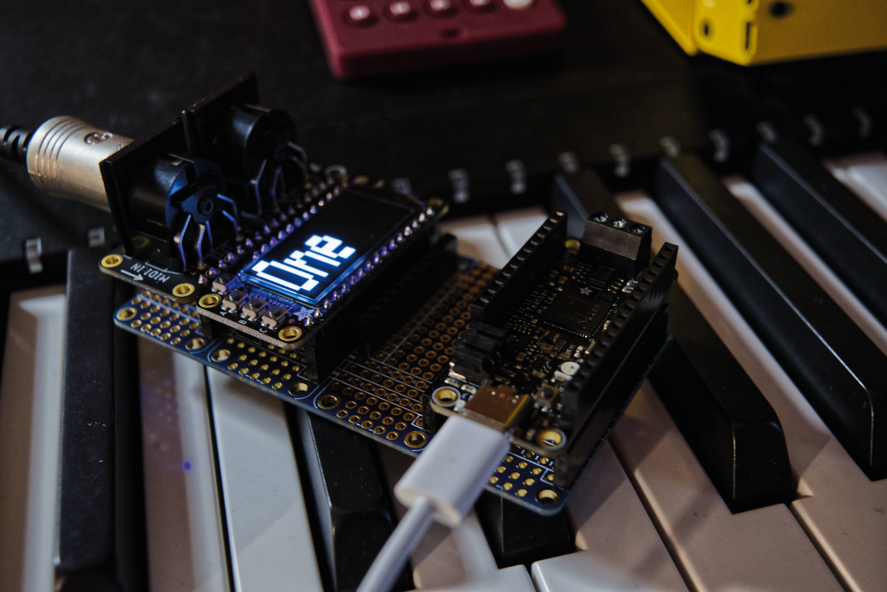

# Simple MIDI beat tracker

This is a simple M4 Express CAN-based MIDI beat tracker. It uses an Adafruit OLED display to show the beat, features three different display modes and uses the MIDI FeatherWing to receive start, stop and clock messages.

Using USB-MIDI library for handling MIDI on the SAME51 MCU.

## Code

Project code is pretty self-explanatory. Button A, B and C are using definitions provided for use with the OLED FeatherWing used, but the Adafruit GFX library can drive any Adafruit-branded display the same way.

Special care was taken to ensure the MCU is free to read every single incoming MIDI clock signal, as timing issues arise when a MIDI clock is skipped. While the code is build to be portable, issues may arise with slower cores.

Do note that the `display.clear()` command clears only the display buffer, as per Adafruit's documentation.

The tracker only supports common time, and stops counting unless the connected MIDI device is playing back. Every MIDI start signal triggers a new count.

The beat calculations are done assuming the MIDI clock standard of 24 signals per quarter note is adhered to in the protocol implementation of the target device.
